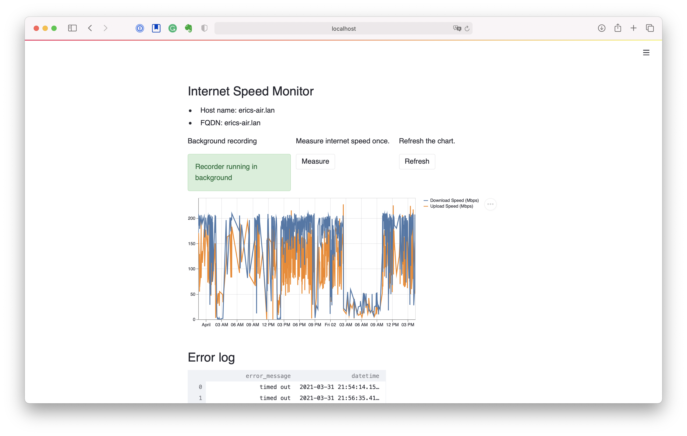

# Internet Speed Monitor

I've been curious to see how my internet speed varies
during the day on my devices.
As such, I decided to start collecting data.

## Quickstart

Install the package:

```bash
pip install netspeedmonitor
```

Run the app from the command line:

```bash
netspeedmonitor app
```

If you'd like the app to run in the background:

```bash
netspeedmonitor app &
```

Be sure to take note of the process ID (PID)
so that you can kill it as necessary.

To view the monitor UI, go to your [localhost in the browser on port 8501
([http://localhost:8501][localhost]).

[localhost]: http://localhost:8501



## How this app works

There are two ways to measure internet speed.
Firstly, we can measure raw upload and download speed
by sending or receiving packets from a server.
It gives us a direct, quantitative and accurate measure
of how fast our internet speed is,
but it consumes a non-trivial amount of bandwidth.
Secondly, we can measure latency of a ping request from one host to another host.
This consumes trivial amounts of bandwidth, but is less accurate.
We combine the two together inside a single command line tool
that continuously monitors your internet speed using both methods.

To do direct internet speed measurement,
underneath the hood, we use the [`speedtest-cli`][speedtest] package
to send packets to Ookla's speed testing servers.
We also use the `tcp_latency` package to ping sentinel servers
and machines on the local network.
As a matter of sane defaults, pinging is done every 2-3 minutes,
while direct measurements are done every 15 minutes.

The results are then logged to a [TinyDB][tinydb].
To ensure atomic transactions, we use [`tinyrecord`][tinyrecord].
Only a single instance of the app can be run per machine,
because we use [`tendo`'s][tendo] `singleinstance` module
to ensure only a single instance runs on one machine.
(Running multiple instances may clog up your internet
especially if you are pinging Ookla's speed testing servers frequently,
so we only allow a single instance to be run per machine.
We use [`schedule`][schedule]
to run `speedtest-cli`'s speed testing functions
on a user-configurable interval.
Logging is made simple by using [`loguru`][loguru]
The UI is built using [`streamlit`][streamlit];
it was super fast and easy to build, kudos to the team!

[speedtest]: https://pypi.org/project/speedtest-cli/
[tinydb]: https://tinydb.readthedocs.io/en/latest/
[tinyrecord]: https://github.com/eugene-eeo/tinyrecord
[streamlit]: https://docs.streamlit.io/en/stable/
[schedule]: https://schedule.readthedocs.io/en/stable/
[loguru]: https://github.com/Delgan/loguru
[tendo]: https://github.com/pycontribs/tendo

## Precautions to take

`speedtest-cli` sends about a few dozens of megabytes of data per test.
As such, if you're using metered internet
(i.e. one that has a data cap)
such as a hotspot on your phone,
you'll want to limit the frequency at which you ping Ookla's servers
or prevent the process from running in the background.

## Your internet speed data is private and yours by default

The open source package stores data in your home directory.
By default it will store data at `~/.speedtest.json`.
(JSON is the default storage format for TinyDB.)
You can inspect the source;
by design, no measurement data is sent anywhere.

In fact, if you'd like to do your own analysis on the data,
here's a code snippet that you can use to analyze it.

```python
from tinydb import TinyDB

db = TinyDB("~/.speedtest.json")
df = pd.DataFrame(db.all())
```

## Database Schema

Inside the TinyDB on disk, there are three tables. Here are their schemas.

### `speed`

This records the internet speed as measured by the `speedtest-cli` package.
Per record, the fields are:

1. `upload_speed`: Upload speed.
2. `download_speed`: Download speed.
3. `datetime`: Date and time of measurement.

### `speed_errors`

This records any errors that `speedtest-cli` may throw up during testing. Per record, the fields are:

1. `error_message`: The error message returned.
2. `datetime`: Date and time of measurement.

### `latency`

This records the internet latency as measured by the `tcp_latency` package. Per record, the fields are:

1. `host`: The IP address or hostname that was pinged.
2. `latency`: The latency recorded.
3. `datetime`: Date and time of measurement.
4. `kind`: Either `local` or `sentinel`.

Sentinel sites are:

- `google.com`
- `bing.com`
- `yahoo.com`
- `bbc.co.uk`

These are sites we expect to always be up and running.

Local sites are anything on your subnet.

## Contributing and supporting the project

Contributions are welcome; support is even more welcome!
Here's how you can help:

1. Star the repo!
2. Spread word about it on Twitter.
3. Help test-drive the app.
4. Test-drive the app on your Raspberry Pi.
4. Make PRs to knock items off the roadmap.

## Roadmap

- [ ] Changing storage location (lets you back up on cloud storage).


[bmac]: https://www.buymeacoffee.com/pularijuto
[patreon]: https://www.patreon.com/ericmjl
